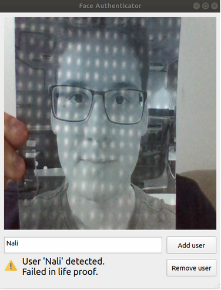
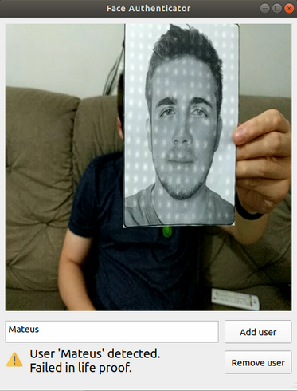
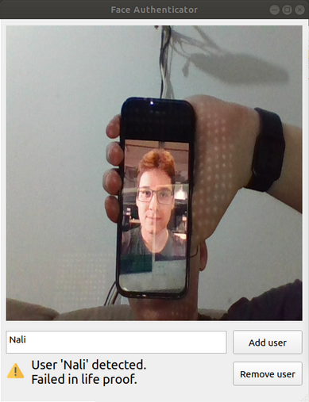
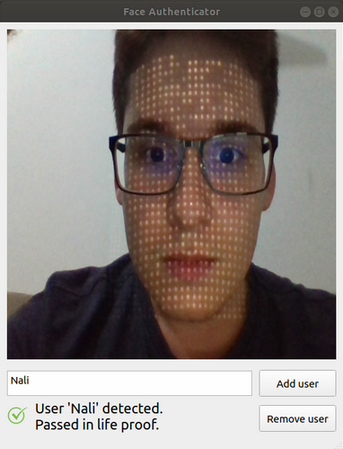
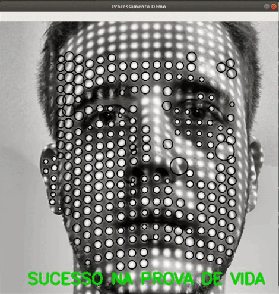
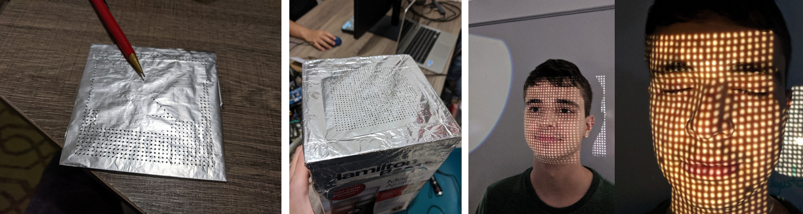
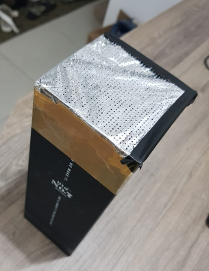
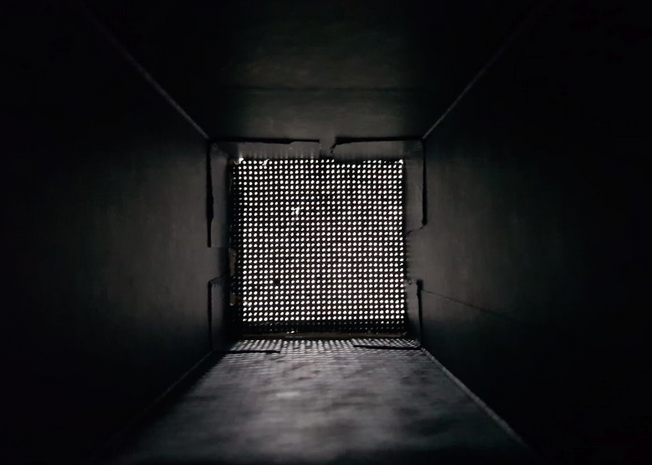

# Face authenticator

A face authenticator system with life proof verification using cloud points.

# Features

## Face recognition and life proof verification
### Life proof failed in tests with printed and smartphone photos.





### Life proof sucess in a test with a real person.




# Our cloud point generator

We used a mechanical pencil with a PCB board to make holes in a sheet of aluminum foil. Then, we fixed the punched aluminum foil in a cardboard box with adhesive tape. As light source we used a  smartphone flashlight.






\* It's also possible to use infrared led with a camera without IR filter.

# Getting Started
## Prerequisites

```
sudo apt install cmake
sudo apt install g++
sudo apt install python3-dev
```

```
pip install -r requirements.txt
```
\* Developed on Python 3.6.9 
## Run
```
python main.py
```    

# Developers
* [Augusto Ribeiro Castro](https://github.com/GuttinRibeiro)
* Gustavo Alvim Gava
* [Mateus Rocha de Medeiros](https://github.com/mateus-rm) 
* [Matheus Carvalho Nali](https://github.com/MatheusNali)